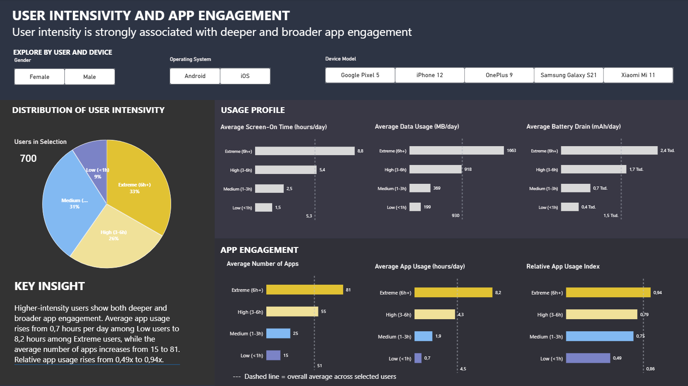
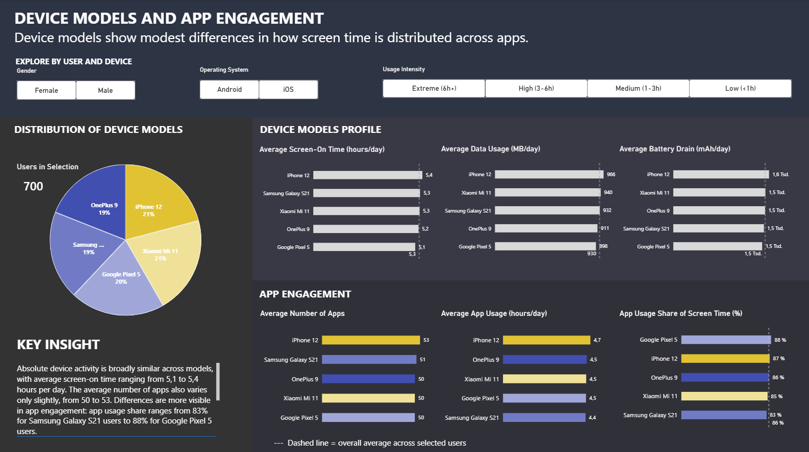

# Decoding Device Behavior

📱 An interactive Power BI dashboard that translates mobile-device telemetry into user segments, engagement patterns, and actionable insights on app usage, data consumption, and battery performance.



*User intensity is the strongest behavioural lens in this dataset: higher-intensity users spend more time in apps, use a broader range of apps, and devote a larger share of screen time to app activity.*



*Device models show modest differences in app engagement, while absolute device activity remains broadly similar.*

---

## Project overview

Mobile devices generate thousands of daily telemetry signals. This project explores what those signals reveal about user behaviour by comparing two complementary perspectives:

1. **User intensity:** How do users with low, medium, high, and extreme device activity differ in their app engagement?
2. **Device models:** Do usage patterns, app engagement, data consumption, and battery drain differ meaningfully across device models?

The report is designed as a two-page data story. It first identifies the behavioural differences between user-intensity segments, then examines whether device model provides an additional explanation for observed engagement patterns.

## Key findings

### 1. User intensity is the primary behavioural difference

Higher-intensity users show both deeper and broader app engagement:

- Average app usage rises from approximately **0.7 hours per day** among Low users to **8.2 hours per day** among Extreme users.
- The average number of apps rises from approximately **15** to **81**.
- App usage share of screen-on time rises from approximately **49%** to **94%**.

This indicates that higher-intensity users not only spend more time on their devices, but also use a broader range of apps and allocate a larger share of screen time to app activity.

### 2. Device models add modest variation

Across the five device models, absolute device activity is broadly similar:

- Average screen-on time ranges from approximately **5.1 to 5.4 hours per day**.
- Average data usage ranges from approximately **898 to 966 MB per day**.
- Average battery drain ranges from approximately **1.5 to 1.6 thousand mAh per day**.
- The average number of apps used ranges from approximately **50 to 53**.

Differences are more visible in the relative share of screen time spent in apps, which ranges from approximately **83% to 88%** across device models. In this dataset, user intensity appears to be a more informative lens for understanding app engagement than device model.

> These findings are descriptive. They identify patterns in the available data but do not establish that user intensity or device model causes a specific usage outcome.

## Dashboard structure

| Page | Question | Main measures |
|---|---|---|
| **User Intensity and App Engagement** | How do behavioural intensity segments differ in app engagement? | Average screen-on time, data usage, battery drain, average number of apps, average app usage, app usage share of screen time |
| **Device Models and App Engagement** | How similar or different are engagement patterns across device models? | Average screen-on time, data usage, battery drain, average number of apps, average app usage, app usage share of screen time |

## Interactivity

Both report pages include slicers for:

- Gender
- Operating system
- Device model or usage intensity, depending on the page

The Key Insight text is generated dynamically with DAX and updates with the current slicer selection. Dashed reference lines show the overall average for the currently selected users.

## Tools and methods

- **Power BI** for interactive report design and data storytelling
- **DAX** for dynamic measures, segment comparisons, and dynamic Key Insight text
- **Power Query** for data preparation and transformation
- **Python** for exploratory data analysis

## Data citation

This project uses the following dataset:

> Khorasani, V. (2024). *Mobile Device Usage and User Behavior Dataset* [Data set]. Kaggle. [https://doi.org/10.34740/KAGGLE/DV/4455](https://doi.org/10.34740/KAGGLE/DV/4455)

**License:** Apache 2.0  
**Accessed:** September 2026

## Repository structure

```text
.
├── 01_data/                 # Source data and/or prepared data
├── 03_dashboard/            # Power BI report files and documentation, if shared
├── 04_screenshots/          # Dashboard previews used in this README
│   ├── user-intensity-app-engagement_v02.png
│   └── mobile-devices-app-engagement_v01.png
└── README.md
```

---

*Built as a portfolio project exploring how product telemetry can be translated into clear customer and user-behaviour insights.*