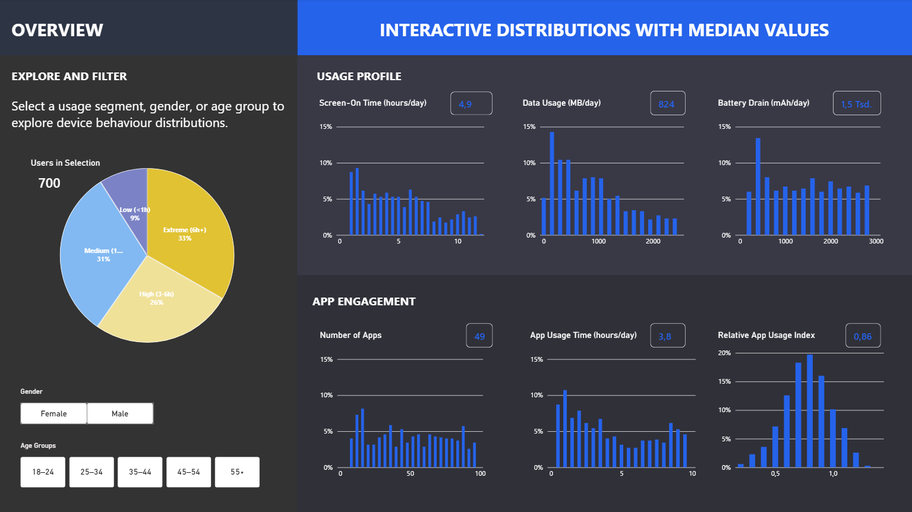

# Decoding Device Behavior

📱 An interactive Power BI dashboard that translates mobile-device telemetry into user segments, engagement patterns, and actionable insights on app usage, data consumption, and battery performance.

## Interactive Distributions and Medians



This overview page provides an interactive view of device behaviour across the user population. It combines distribution charts with median KPI cards to show both the shape of each metric and the typical value within the currently selected user group.

### Explore and filter

Users can interact with the dashboard through three segmentation dimensions:

- **Usage intensity:** Low (<1h), Medium (1–3h), High (3–6h), and Extreme (6h+)
- **Gender**
- **Age group:** 18–24, 25–34, 35–44, 45–54, and 55+

Selecting a usage-intensity segment highlights its contribution within the full distributions. Gender and age-group slicers filter the population and update all charts and median values.

### Metrics covered

The page groups six behavioural metrics into two perspectives:

| Usage profile | App engagement |
|---|---|
| Screen-On Time (hours/day) | Number of Apps |
| Data Usage (MB/day) | App Usage Time (hours/day) |
| Battery Drain (mAh/day) | Relative App Usage Index |

The histogram-style visuals show the distribution of users across each metric. The KPI cards display the **median** for the active selection, making the overview less sensitive to extreme observations than an average-based summary.

### Relative App Usage Index

The Relative App Usage Index is calculated as:

```text
App Usage Time (min/day) ÷ Screen-On Time (min/day)
```

A value of `0.86x`, for example, means that recorded app usage is 0.86 times the recorded screen-on time.

Some source records produce values above `1.00x`. Because the underlying dataset is synthetic and the two source time metrics are not strictly constrained as parts of the same time budget, the metric is presented as a **relative index** rather than a percentage share. No values were capped or altered.

## User Intensity and App Engagement


*User intensity is the strongest behavioural lens in this dataset: higher-intensity users spend more time in apps, use a broader range of apps, and show higher relative app usage.*

## Device Models and App Engagement


*Device models show modest differences in app engagement, while absolute device activity remains broadly similar.*

---

## Project overview

Mobile devices generate thousands of daily telemetry signals. This project explores what those signals reveal about user behaviour through three complementary views:

1. **Distribution overview:** How are device-behaviour metrics distributed across the population, and how do those distributions differ by usage intensity, gender, and age group?
2. **User intensity:** How do users with low, medium, high, and extreme device activity differ in app engagement?
3. **Device models:** Do usage patterns, app engagement, data consumption, and battery drain differ meaningfully across device models?

The report is designed as a three-page data story. It first establishes the population baseline through interactive distributions and median values, then compares behavioural intensity segments, and finally examines whether device model provides an additional explanation for observed engagement patterns.

## Key findings

### 1. User intensity is the primary behavioural difference

Higher-intensity users show both deeper and broader app engagement:

- Average app usage rises from approximately **0.7 hours per day** among Low users to **8.2 hours per day** among Extreme users.
- The average number of apps rises from approximately **15** to **81**.
- Relative App Usage Index rises from approximately **0.49x** to **0.94x**.

This indicates that higher-intensity users not only spend more time on their devices, but also use a broader range of apps and record higher app usage relative to screen-on time.

### 2. Device models add modest variation

Across the five device models, absolute device activity is broadly similar:

- Average screen-on time ranges from approximately **5.1 to 5.4 hours per day**.
- Average data usage ranges from approximately **898 to 966 MB per day**.
- Average battery drain ranges from approximately **1.5 to 1.6 thousand mAh per day**.
- The average number of apps used ranges from approximately **50 to 53**.

Differences are more visible in relative app usage, which ranges from approximately **0.83x to 0.88x** across device models. In this dataset, user intensity appears to be a more informative lens for understanding app engagement than device model.

> These findings are descriptive. They identify patterns in the available data but do not establish that user intensity or device model causes a specific usage outcome.

## Dashboard structure

| Page | Question | Main measures |
|---|---|---|
| **Interactive Distributions and Medians** | How are device-behaviour metrics distributed across the selected user population? | Median screen-on time, data usage, battery drain, number of apps, app usage time, Relative App Usage Index |
| **User Intensity and App Engagement** | How do behavioural intensity segments differ in app engagement? | Average screen-on time, data usage, battery drain, average number of apps, average app usage, Relative App Usage Index |
| **Device Models and App Engagement** | How similar or different are engagement patterns across device models? | Average screen-on time, data usage, battery drain, average number of apps, average app usage, Relative App Usage Index |

## Interactivity

The overview page includes interactive filtering by:

- Usage intensity
- Gender
- Age group

The two analytical comparison pages include slicers for:

- Gender
- Operating system
- Device model or usage intensity, depending on the page

The Key Insight text is generated dynamically with DAX and updates with the current slicer selection. Dashed reference lines show the overall average for the currently selected users.

## Tools and methods

- **Power BI** for interactive report design and data storytelling
- **DAX** for dynamic measures, segment comparisons, and dynamic Key Insight text
- **Power Query** for data preparation and transformation
- **Python** for exploratory data analysis

## Data citation

This project uses the following dataset:

> Khorasani, V. (2024). *Mobile Device Usage and User Behavior Dataset* [Data set]. Kaggle. [https://doi.org/10.34740/KAGGLE/DV/4455](https://doi.org/10.34740/KAGGLE/DV/4455)

**License:** Apache 2.0  
**Accessed:** September 2026

## Repository structure

```text
.
├── 01_data/                                     # Source data and/or prepared data
├── 02_exploration/                              # Jupyter notebooks
├── 03_dashboard/                                # Power BI report files
│   ├── 03_user_behavior_dataset_cleaned.pbix    # Interactive Power BI dashboard
├── 04_screenshots/                              # Dashboard previews used in this README
│   ├── device-behaviour-overview-interactive-distributions-and-medians.png
│   ├── user-intensity-app-engagement_v02.png
│   └── mobile-devices-app-engagement_v01.png
└── README.md
```

## Open the dashboard

1. Download or clone this repository.
2. Open the `.pbix` file in the `03_dashboard` folder with **Power BI Desktop**.
3. If prompted, update the data-source path to the local file in `01_data`.
4. Use the report slicers and visual interactions to explore user segments, device models, and behavioural distributions.

---

*Built as a portfolio project exploring how product telemetry can be translated into clear customer and user-behaviour insights.*